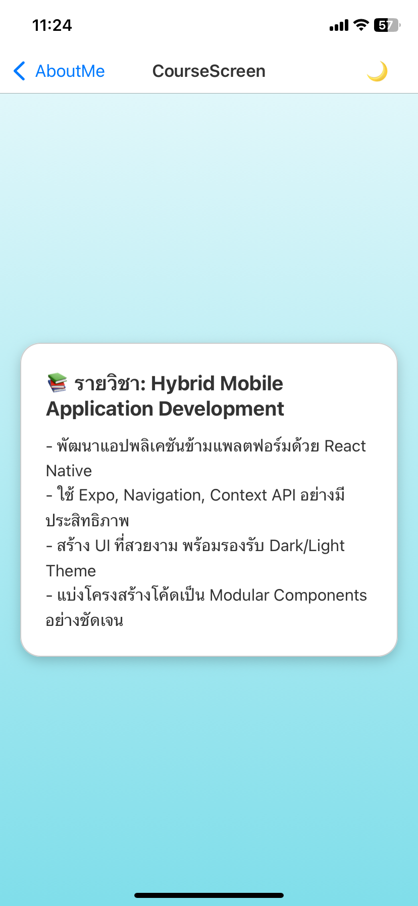
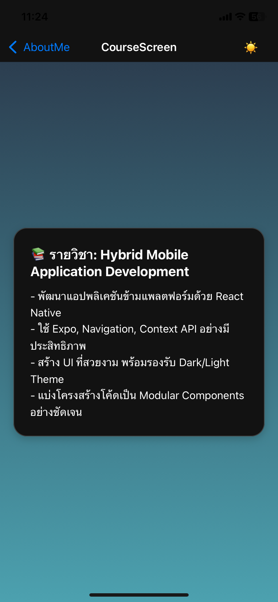

# 🌟 My Portfolio App (React Native + Expo)

แอปพลิเคชันส่วนตัวแนะนำตัวเองและแสดงความสามารถ สร้างด้วย React Native และ Expo  
รองรับ **ธีมสว่าง/มืด** และมีการจัดหน้าแบบมืออาชีพพร้อม Gradient พื้นหลังสวยงาม

---

## 🚀 ฟีเจอร์หลัก

- 🏠 **หน้า Home**:  
  - แสดงข้อความต้อนรับและภาพโปรไฟล์  
  - ปุ่มนำไปยังหน้า AboutMe

- 👨‍💻 **หน้า About Me**:  
  - แสดงชื่อ รหัสนิสิต สาขา มหาวิทยาลัย  
  - แสดงความสามารถ (Skills) ในรูปแบบ Badge  
  - ปุ่มย้อนกลับสู่หน้าแรก

- 🎨 **เปลี่ยนธีม (Theme Toggle)**:  
  - รองรับธีม Light/Dark  
  - ใช้ context และปุ่มบนทุกหน้าเพื่อเปลี่ยนธีมได้แบบเรียลไทม์

---

## 📦 เทคโนโลยีที่ใช้

- [React Native](https://reactnative.dev/)
- [Expo](https://expo.dev/)
- [`@react-navigation/native`](https://reactnavigation.org/)
- [`expo-linear-gradient`](https://docs.expo.dev/versions/latest/sdk/linear-gradient/)
- Context API สำหรับจัดการธีม
---

| หน้าจอโปรแกรม (ตัวอย่าง) |
|---------------------------|








---

## ⚙️ การติดตั้ง

1. ติดตั้ง Expo CLI (ถ้ายังไม่เคย):
```bash
   npm install -g expo-cli
   npx expo install react-native-screens react-native-safe-area-context
   npx expo install @react-navigation/native
   npx expo install @react-navigation/native-stack
   npx expo install expo-linear-gradient


```

